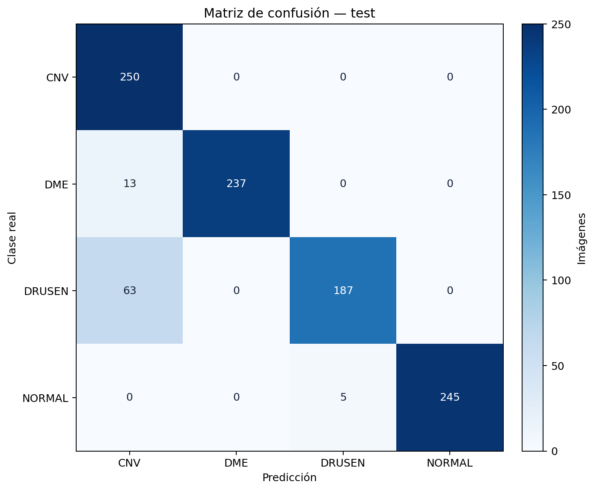

# Resultados de prueba OCT | OCT test results

[Español](#español) · [English](#english)

## Español

El autor compartió el siguiente resumen de métricas y la matriz de confusión del conjunto de prueba OCT el 23 de septiembre de 2026. Indicó aproximadamente **30 000 imágenes de entrenamiento**. La matriz contiene exactamente **1 000 imágenes de prueba**, 250 por clase. Se transcriben las métricas con la precisión recibida; a partir de la matriz se comprobaron la exactitud y la exactitud equilibrada.

| Métrica | Valor |
| --- | ---: |
| Exactitud (accuracy) | 0.919000 |
| Exactitud equilibrada | 0.919000 |
| Precisión macro | 0.935207 |
| Sensibilidad macro | 0.919000 |
| F1 macro | 0.919354 |
| F1 ponderado | 0.919354 |
| Kappa de Cohen | 0.892000 |
| Pérdida logarítmica | 0.234802 |
| AUC macro | 0.992719 |
| AUC micro | 0.988292 |

### Matriz de confusión

Las filas son la clase real y las columnas la predicción:

| Real \ Predicción | CNV | DME | DRUSEN | NORMAL |
| --- | ---: | ---: | ---: | ---: |
| CNV | 250 | 0 | 0 | 0 |
| DME | 13 | 237 | 0 | 0 |
| DRUSEN | 63 | 0 | 187 | 0 |
| NORMAL | 0 | 0 | 5 | 245 |

La diagonal suma **919 aciertos de 1 000**. La sensibilidad por clase es CNV **100 %**, DME **94.8 %**, DRUSEN **74.8 %** y NORMAL **98 %**; su promedio es **91.9 %**, consistente con la exactitud equilibrada proporcionada. El principal error es la confusión de **63 imágenes DRUSEN como CNV**. El F1 macro reportado es **0.919354**.

La matriz permite comprobar los recuentos, pero para interpretar el resultado plenamente todavía faltan el número de pacientes, el criterio exacto de separación, el modelo o ensamble evaluado, el identificador del experimento, las predicciones y los intervalos de confianza. AUC y pérdida logarítmica requieren probabilidades; no pueden recalcularse a partir de esta matriz.

El resultado es de investigación y no establece desempeño clínico ni validación externa.

## English

The author supplied this OCT test-set metric summary and confusion matrix on September 23, 2026 and reported approximately **30,000 training images**. The matrix contains exactly **1,000 test images**, 250 per class. Values are transcribed at the supplied precision; accuracy and balanced accuracy were checked from the matrix.

| Metric | Value |
| --- | ---: |
| Accuracy | 0.919000 |
| Balanced accuracy | 0.919000 |
| Macro precision | 0.935207 |
| Macro recall | 0.919000 |
| Macro F1 | 0.919354 |
| Weighted F1 | 0.919354 |
| Cohen's kappa | 0.892000 |
| Log loss | 0.234802 |
| Macro AUC | 0.992719 |
| Micro AUC | 0.988292 |

### Confusion matrix

Rows represent actual classes and columns predicted classes:

| Actual \ Predicted | CNV | DME | DRUSEN | NORMAL |
| --- | ---: | ---: | ---: | ---: |
| CNV | 250 | 0 | 0 | 0 |
| DME | 13 | 237 | 0 | 0 |
| DRUSEN | 63 | 0 | 187 | 0 |
| NORMAL | 0 | 0 | 5 | 245 |

The diagonal contains **919 correct predictions out of 1,000**. Per-class recall is **100%** for CNV, **94.8%** for DME, **74.8%** for DRUSEN and **98%** for NORMAL; their mean is **91.9%**, matching the supplied balanced accuracy. The largest error group is **63 DRUSEN images classified as CNV**.

Full interpretation still requires patient count, exact split method, evaluated model or ensemble, experiment ID, predictions and confidence intervals. AUC and log loss require probabilities and cannot be recomputed from this matrix.

This is a research result and does not establish clinical performance or external validation.
